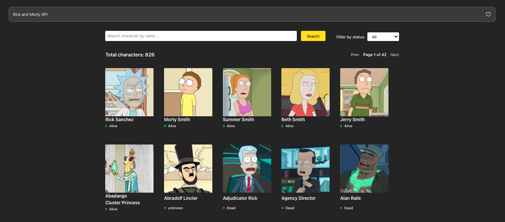

# 🚀 React Workshop

This project showcases how to implement essential features that every modern React app should include. The goal is to demonstrate clean and functional approaches to:

- 🔍 Building a search bar
- ✅ Implementing filters (e.g., by status)
- 🌐 Fetching and displaying data from a public API
- 🔄 Pagination support
- ⚠️ Handling loading and error states properly
- 🎯 Clean component organization

The application uses the [Rick and Morty API](https://rickandmortyapi.com/) as the data source and includes real-time filtering and search functionality, resulting in an intuitive and responsive user interface.

## 🧱 Tech Stack

- **React** (with Vite)
- **TypeScript**
- **Tailwind CSS**
- **React Query** (`@tanstack/react-query`)

## 🖼 Preview
